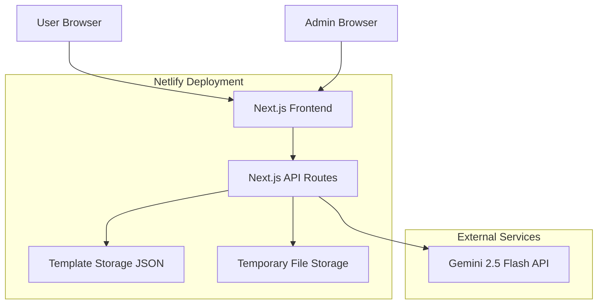

# Design Document

## Overview

TempHub is an AI-powered image generation platform built with Next.js 14 (App Router), React, and TypeScript. The platform leverages Google's Gemini 2.5 Flash Image Preview API to transform user-uploaded images according to pre-designed templates. The architecture follows a serverless approach suitable for Netlify deployment, with API routes handling backend logic and a responsive React frontend for user interaction.

The system consists of two main interfaces:
1. **Public Gallery**: Template browsing, image upload, and AI generation
2. **Admin Panel**: Template CRUD operations

All data is stored in a JSON file-based system for simplicity, with no user authentication required. Sessions are stateless, and no user data persists beyond the current browser session.

## Architecture

### High-Level Architecture



### Technology Stack

**Frontend:**
- Next.js 14 (App Router)
- React 18
- TypeScript
- Tailwind CSS (for styling)
- Shadcn/ui (component library)
- React Query (for data fetching and caching)
- Zustand (lightweight state management)

**Backend:**
- Next.js API Routes (serverless functions)
- Google Generative AI SDK (@google/generative-ai)
- File system for template storage (JSON)
- Multer or built-in Next.js file handling for uploads

**Deployment:**
- Netlify (hosting and serverless functions)
- Environment variables for API keys

**Development Tools:**
- ESLint & Prettier
- TypeScript strict mode

### Folder Structure

```
temphub/
├── app/
│   ├── (public)/
│   │   ├── page.tsx                 # Home page with template gallery
│   │   ├── template/
│   │   │   └── [id]/
│   │   │       └── page.tsx         # Template detail & generation page
│   │   └── layout.tsx
│   ├── admin/
│   │   ├── page.tsx                 # Admin dashboard
│   │   ├── templates/
│   │   │   ├── new/
│   │   │   │   └── page.tsx         # Create template
│   │   │   └── [id]/
│   │   │       └── edit/
│   │   │           └── page.tsx     # Edit template
│   │   └── layout.tsx
│   ├── api/
│   │   ├── templates/
│   │   │   ├── route.ts             # GET all, POST new
│   │   │   └── [id]/
│   │   │       └── route.ts         # GET, PUT, DELETE specific
│   │   ├── generate/
│   │   │   └── route.ts             # POST - AI image generation
│   │   └── upload/
│   │       └── route.ts             # POST - image upload
│   ├── layout.tsx
│   └── globals.css
├── components/
│   ├── ui/                          # Shadcn components
│   ├── template-card.tsx
│   ├── template-gallery.tsx
│   ├── category-filter.tsx
│   ├── image-uploader.tsx
│   ├── generation-progress.tsx
│   ├── admin/
│   │   ├── template-form.tsx
│   │   └── template-list.tsx
│   └── error-boundary.tsx
├── lib/
│   ├── gemini.ts                    # Gemini API client
│   ├── templates.ts                 # Template data operations
│   ├── validation.ts                # Input validation
│   └── utils.ts                     # Utility functions
├── types/
│   └── index.ts                     # TypeScript types
├── data/
│   ├── templates.json               # Template storage
│   └── categories.json              # Category definitions
├── public/
│   └── template-previews/           # Template preview images
├── .env.local
├── .env.example
├── next.config.js
├── tailwind.config.ts
└── tsconfig.json
```

## Components and Interfaces

### Frontend Components

#### 1. Template Gallery Component
**Purpose**: Display templates with category filtering and lazy loading

**Props:**
```typescript
interface TemplateGalleryProps {
  initialTemplates: Template[];
  categories: Category[];
}
```

**Features:**
- Category filter tabs (All, Product, Character, etc.)
- Infinite scroll with lazy loading
- Responsive grid layout
- Template card with preview image, title, category badge

#### 2. Template Card Component
**Purpose**: Display individual template preview

**Props:**
```typescript
interface TemplateCardProps {
  template: Template;
  onClick: () => void;
}
```

**Features:**
- Preview image with hover effect
- Template title and category
- Click to navigate to generation page

#### 3. Image Uploader Component
**Purpose**: Handle user image upload with validation

**Props:**
```typescript
interface ImageUploaderProps {
  onUpload: (file: File) => void;
  maxSize: number; // in MB
  acceptedFormats: string[];
}
```

**Features:**
- Drag-and-drop support
- File size validation (5MB max)
- Format validation
- Image preview after upload
- Error messages for invalid uploads

#### 4. Generation Progress Component
**Purpose**: Show AI generation progress

**Props:**
```typescript
interface GenerationProgressProps {
  status: 'idle' | 'uploading' | 'generating' | 'complete' | 'error';
  progress?: number;
  error?: string;
}
```

**Features:**
- Loading spinner
- Progress indicator
- Estimated time remaining
- Error display with retry button

#### 5. Admin Template Form Component
**Purpose**: Create/edit templates

**Props:**
```typescript
interface TemplateFormProps {
  template?: Template; // undefined for new, populated for edit
  onSubmit: (data: TemplateFormData) => Promise<void>;
  onCancel: () => void;
}
```

**Features:**
- Form fields: name, category, prompt, preview image
- Real-time validation
- Preview image upload
- Rich text editor for prompt (optional)
- Save and cancel buttons

### API Endpoints

#### 1. GET /api/templates
**Purpose**: Fetch all templates or filtered by category

**Query Parameters:**
- `category` (optional): Filter by category

**Response:**
```typescript
{
  templates: Template[];
  total: number;
}
```

#### 2. POST /api/templates
**Purpose**: Create new template

**Request Body:**
```typescript
{
  name: string;
  category: string;
  prompt: string;
  previewImage: string; // base64 or file path
}
```

**Response:**
```typescript
{
  template: Template;
  message: string;
}
```

#### 3. GET /api/templates/[id]
**Purpose**: Fetch specific template

**Response:**
```typescript
{
  template: Template;
}
```

#### 4. PUT /api/templates/[id]
**Purpose**: Update template

**Request Body:** Same as POST

**Response:**
```typescript
{
  template: Template;
  message: string;
}
```

#### 5. DELETE /api/templates/[id]
**Purpose**: Delete template

**Response:**
```typescript
{
  message: string;
}
```

#### 6. POST /api/upload
**Purpose**: Handle user image upload

**Request:** multipart/form-data with image file

**Response:**
```typescript
{
  imageUrl: string; // temporary URL or base64
  imageData: string; // base64 for API
}
```

#### 7. POST /api/generate
**Purpose**: Generate AI image using Gemini API

**Request Body:**
```typescript
{
  templateId: string;
  imageData: string; // base64
}
```

**Response:**
```typescript
{
  generatedImage: string; // base64
  mimeType: string;
}
```

## Data Models

### Template Model
```typescript
interface Template {
  id: string;
  name: string;
  category: string;
  prompt: string;
  previewImage: string; // URL or path
  createdAt: string;
  updatedAt: string;
}
```

### Category Model
```typescript
interface Category {
  id: string;
  name: string;
  slug: string;
  description?: string;
}
```

### Generation Request Model
```typescript
interface GenerationRequest {
  templateId: string;
  userImage: File | string; // File object or base64
}
```

### Generation Response Model
```typescript
interface GenerationResponse {
  success: boolean;
  generatedImage?: string; // base64
  mimeType?: string;
  error?: {
    code: string;
    message: string;
    retryable: boolean;
  };
}
```

## Gemini API Integration

### Configuration

```typescript
// lib/gemini.ts
import { GoogleGenerativeAI } from '@google/generative-ai';

const genAI = new GoogleGenerativeAI(process.env.GEMINI_API_KEY!);

export async function generateImage(
  prompt: string,
  userImage: string // base64
): Promise<GenerationResponse> {
  try {
    const model = genAI.getGenerativeModel({ 
      model: 'gemini-2.0-flash-exp' 
    });
    
    // Convert base64 to proper format
    const imagePart = {
      inlineData: {
        data: userImage.split(',')[1], // Remove data:image/... prefix
        mimeType: 'image/jpeg'
      }
    };
    
    const result = await model.generateContent([
      prompt,
      imagePart
    ]);
    
    const response = await result.response;
    // Process response and return generated image
    
    return {
      success: true,
      generatedImage: response.text(), // Adjust based on actual API response
      mimeType: 'image/png'
    };
  } catch (error) {
    return handleGeminiError(error);
  }
}
```

### Error Handling

```typescript
function handleGeminiError(error: any): GenerationResponse {
  if (error.status === 429) {
    return {
      success: false,
      error: {
        code: 'RATE_LIMIT',
        message: 'API rate limit exceeded. Please try again later.',
        retryable: true
      }
    };
  }
  
  if (error.status === 400) {
    return {
      success: false,
      error: {
        code: 'INVALID_REQUEST',
        message: 'Invalid image or prompt. Please try again.',
        retryable: true
      }
    };
  }
  
  return {
    success: false,
    error: {
      code: 'UNKNOWN_ERROR',
      message: 'An unexpected error occurred. Please try again.',
      retryable: true
    }
  };
}
```

## Template Storage System

### JSON File Structure

```json
{
  "templates": [
    {
      "id": "uuid-1",
      "name": "TIME Magazine Cover",
      "category": "magazine",
      "prompt": "Create a professional TIME Magazine cover featuring the person in the uploaded image. The cover should have the iconic TIME red border, the TIME logo at the top, and the person should be photographed in a professional, editorial style. Include realistic magazine text elements like 'Person of the Year' or relevant headlines. The lighting should be dramatic and professional, similar to actual TIME covers.",
      "previewImage": "/template-previews/time-magazine.jpg",
      "createdAt": "2025-01-15T10:00:00Z",
      "updatedAt": "2025-01-15T10:00:00Z"
    },
    {
      "id": "uuid-2",
      "name": "Influencer Product Shot",
      "category": "product",
      "prompt": "Create a high-end influencer-style product photograph featuring the product from the uploaded image. The product should be held or displayed by an elegant hand with professional manicure. The background should be minimalist and luxurious (soft neutral tones, marble, or clean white). Lighting should be soft and flattering, creating a premium aesthetic suitable for Instagram or luxury brand marketing.",
      "previewImage": "/template-previews/influencer-product.jpg",
      "createdAt": "2025-01-15T10:30:00Z",
      "updatedAt": "2025-01-15T10:30:00Z"
    }
  ],
  "categories": [
    {
      "id": "cat-1",
      "name": "Magazine",
      "slug": "magazine",
      "description": "Magazine covers and editorial styles"
    },
    {
      "id": "cat-2",
      "name": "Product",
      "slug": "product",
      "description": "Product photography and marketing"
    },
    {
      "id": "cat-3",
      "name": "Character",
      "slug": "character",
      "description": "Character transformations and portraits"
    }
  ]
}
```

### Template Operations

```typescript
// lib/templates.ts
import fs from 'fs/promises';
import path from 'path';

const DATA_PATH = path.join(process.cwd(), 'data', 'templates.json');

export async function getAllTemplates(category?: string): Promise<Template[]> {
  const data = await fs.readFile(DATA_PATH, 'utf-8');
  const { templates } = JSON.parse(data);
  
  if (category && category !== 'all') {
    return templates.filter((t: Template) => t.category === category);
  }
  
  return templates;
}

export async function getTemplateById(id: string): Promise<Template | null> {
  const templates = await getAllTemplates();
  return templates.find(t => t.id === id) || null;
}

export async function createTemplate(data: Omit<Template, 'id' | 'createdAt' | 'updatedAt'>): Promise<Template> {
  const templates = await getAllTemplates();
  
  const newTemplate: Template = {
    ...data,
    id: generateId(),
    createdAt: new Date().toISOString(),
    updatedAt: new Date().toISOString()
  };
  
  templates.push(newTemplate);
  await saveTemplates(templates);
  
  return newTemplate;
}

export async function updateTemplate(id: string, data: Partial<Template>): Promise<Template> {
  const templates = await getAllTemplates();
  const index = templates.findIndex(t => t.id === id);
  
  if (index === -1) {
    throw new Error('Template not found');
  }
  
  templates[index] = {
    ...templates[index],
    ...data,
    updatedAt: new Date().toISOString()
  };
  
  await saveTemplates(templates);
  return templates[index];
}

export async function deleteTemplate(id: string): Promise<void> {
  const templates = await getAllTemplates();
  const filtered = templates.filter(t => t.id !== id);
  await saveTemplates(filtered);
}

async function saveTemplates(templates: Template[]): Promise<void> {
  const data = await fs.readFile(DATA_PATH, 'utf-8');
  const jsonData = JSON.parse(data);
  jsonData.templates = templates;
  await fs.writeFile(DATA_PATH, JSON.stringify(jsonData, null, 2));
}
```

## Error Handling

### Error Types

```typescript
enum ErrorCode {
  FILE_TOO_LARGE = 'FILE_TOO_LARGE',
  INVALID_FILE_TYPE = 'INVALID_FILE_TYPE',
  UPLOAD_FAILED = 'UPLOAD_FAILED',
  GENERATION_FAILED = 'GENERATION_FAILED',
  API_ERROR = 'API_ERROR',
  RATE_LIMIT = 'RATE_LIMIT',
  NETWORK_ERROR = 'NETWORK_ERROR',
  TEMPLATE_NOT_FOUND = 'TEMPLATE_NOT_FOUND',
  VALIDATION_ERROR = 'VALIDATION_ERROR'
}

interface AppError {
  code: ErrorCode;
  message: string;
  retryable: boolean;
  details?: any;
}
```

### Error Handling Strategy

1. **Client-Side Validation**: Validate file size and type before upload
2. **API Error Responses**: Consistent error format across all endpoints
3. **User-Friendly Messages**: Convert technical errors to user-friendly text
4. **Retry Logic**: Implement retry for transient errors (network, rate limits)
5. **Error Logging**: Log errors for debugging (console in development, service in production)

### Error Component

```typescript
// components/error-display.tsx
interface ErrorDisplayProps {
  error: AppError;
  onRetry?: () => void;
}

export function ErrorDisplay({ error, onRetry }: ErrorDisplayProps) {
  const getMessage = () => {
    switch (error.code) {
      case ErrorCode.FILE_TOO_LARGE:
        return 'Image file is too large. Maximum size is 5MB.';
      case ErrorCode.INVALID_FILE_TYPE:
        return 'Invalid file type. Please upload a valid image.';
      case ErrorCode.RATE_LIMIT:
        return 'Too many requests. Please try again in a few minutes.';
      case ErrorCode.NETWORK_ERROR:
        return 'Network connection issue. Please check your internet.';
      default:
        return error.message || 'An unexpected error occurred.';
    }
  };
  
  return (
    <div className="error-container">
      <p>{getMessage()}</p>
      {error.retryable && onRetry && (
        <button onClick={onRetry}>Try Again</button>
      )}
    </div>
  );
}
```

## Testing Strategy

### Unit Tests
- Template CRUD operations
- Validation functions
- Utility functions
- Error handling logic

### Integration Tests
- API endpoints
- Gemini API integration
- File upload flow
- Template generation flow

### E2E Tests (Optional for MVP)
- Complete user journey: browse → select → upload → generate → download
- Admin flow: create → edit → delete template

### Testing Tools
- Jest for unit tests
- React Testing Library for component tests
- Playwright or Cypress for E2E tests (future)

## Performance Optimization

### Image Optimization
- Use Next.js Image component for automatic optimization
- Lazy load template preview images
- Compress uploaded images before sending to API
- Cache generated images in browser session

### API Optimization
- Implement request debouncing for search/filter
- Use React Query for caching API responses
- Implement pagination or infinite scroll for large template lists

### Bundle Optimization
- Code splitting by route
- Dynamic imports for heavy components
- Tree shaking unused code
- Minimize third-party dependencies

## Security Considerations

### API Key Protection
- Store Gemini API key in environment variables
- Never expose API key in client-side code
- Use server-side API routes for all Gemini calls

### File Upload Security
- Validate file types on both client and server
- Limit file size to prevent DoS
- Sanitize file names
- Use temporary storage, auto-delete after processing

### Input Validation
- Validate all user inputs
- Sanitize template prompts to prevent injection
- Implement rate limiting on API endpoints

### Admin Panel Security
- For MVP: No authentication (as per requirements)
- Future: Add password protection or OAuth
- Validate all admin operations server-side

## Deployment Configuration

### Netlify Setup

**netlify.toml:**
```toml
[build]
  command = "npm run build"
  publish = ".next"

[[plugins]]
  package = "@netlify/plugin-nextjs"

[build.environment]
  NODE_VERSION = "18"

[[redirects]]
  from = "/api/*"
  to = "/.netlify/functions/:splat"
  status = 200
```

**Environment Variables:**
```
GEMINI_API_KEY=your_api_key_here
NEXT_PUBLIC_APP_URL=https://your-app.netlify.app
```

### Local Development

**.env.local:**
```
GEMINI_API_KEY=your_local_api_key
NEXT_PUBLIC_APP_URL=http://localhost:3000
```

## Future Enhancements

1. **Multi-Image Upload**: Support multiple images per template
2. **User Accounts**: Save generation history
3. **Template Marketplace**: Allow users to create and share templates
4. **Advanced Editing**: Post-generation image editing tools
5. **Batch Processing**: Generate multiple variations at once
6. **Analytics**: Track popular templates and usage patterns
7. **Payment Integration**: Premium templates or credits system
8. **Social Sharing**: Direct share to social media platforms
